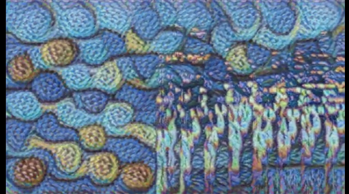
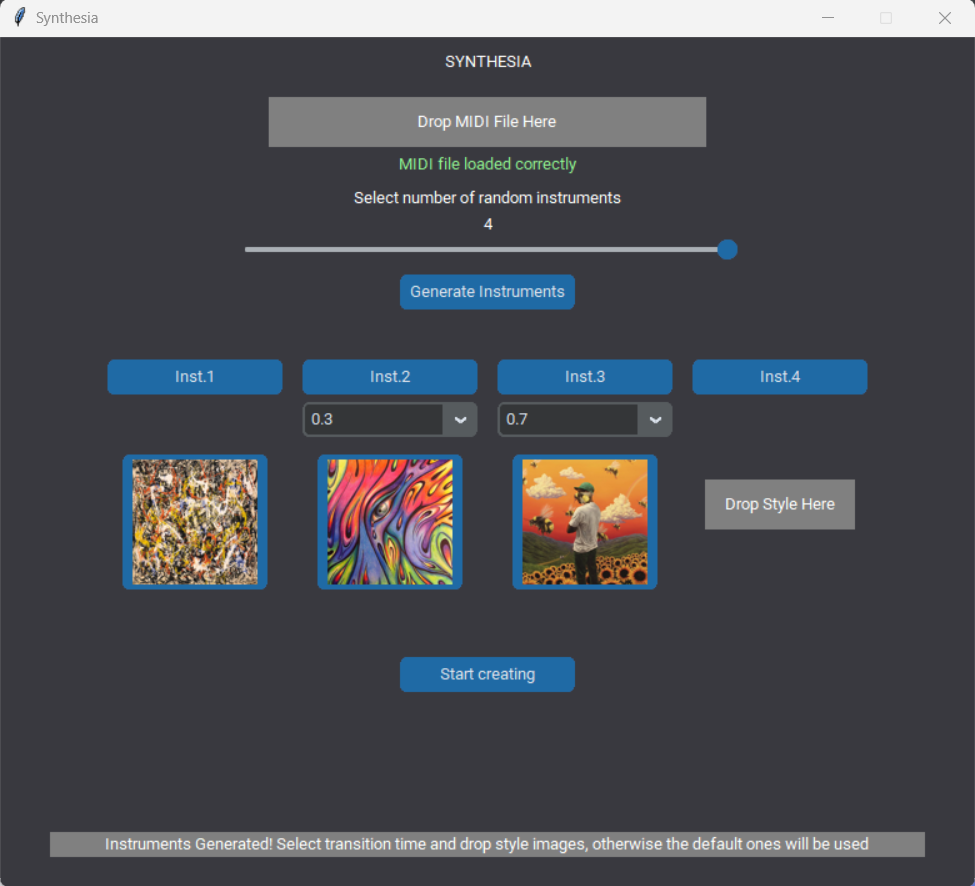
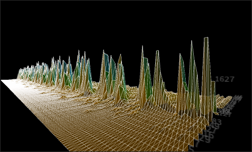

# Synthesia

We introduce Synthesia: An adaptable graphical instrument that enables you to perceive timbre transformation through visual elements.

Our perspective on Synthesia embraces its function as not only a dynamic tool for live performances but also as a standalone application committed to the creation of imaginative videos. Synthesia comprises two separate elements: Synthesia-Live and SynthesiApp.

## SynthesiApp
### Features
SynthesiApp is a Python-based application that lets users load MIDI files and generate videos featuring audio spectrogram transformations, seamlessly transitioning between various styles. The audio generated undergoes a customizable timbre transfer process, giving users complete control over the video's style morphing timestamps.



### Workflow
Through its GUI, SynthesiApp allows users to input a MIDI file for GANSynth to process, specifying the number of instruments for timbre interpolation (ranging from 2 to 4) and providing timestamps utilized by both GANSynth for audio file creation and StyleTransfer for generating the final video. The GUI also enables users to select the images used for style transfer. Meanwhile, behind the scenes, Music-Visualizer is employed to generate the spectrogram video, which is subsequently subjected to the style transfer process.


### Instructions

### Environment setup LINUX
Create a the conda environment to work locally with:
```
conda env create -f mag_tf.yml
```
If no problems occur, you can now activate the environment and work in it. 

If you experience this problem: 
```
/lib/x86_64-linux-gnu/libstdc++.so.6: version 'GLIBCXX_3.4.29' not found
```
It can be solved with <a href="https://github.com/pybind/pybind11/discussions/3453#discussioncomment-7068951">this</a>.

For other problems, please feel free to open an issue.

If you have the possibility to work with CUDA, you can do the following to exploit your GPU:
```
python3 -m pip install nvidia-cudnn-cu11==8.6.0.163
mkdir -p $CONDA_PREFIX/etc/conda/activate.d
echo 'CUDNN_PATH=$(dirname $(python -c "import nvidia.cudnn;print(nvidia.cudnn.__file__)"))' >> $CONDA_PREFIX/etc/conda/activate.d/env_vars.sh
echo 'export LD_LIBRARY_PATH=$CUDNN_PATH/lib:$CONDA_PREFIX/lib/:$LD_LIBRARY_PATH' >> $CONDA_PREFIX/etc/conda/activate.d/env_vars.sh
source $CONDA_PREFIX/etc/conda/activate.d/env_vars.sh
```
You can verify the installation with:
```
python3 -c "import tensorflow as tf; print(tf.config.list_physical_devices('GPU'))"
```
This is an adaptation of the official tensorflow w/o GPU <a href="https://www.tensorflow.org/install/pip?hl=it">installation guide</a>.r

## Synthesia-Live
### Features
Synthesia-Live operates in real-time, applying style transfer techniques to the incoming audio's spectrogram. This process combines two distinct styles in accordance with the user's timbre morphing preferences.

### Workflow
Synthesia-Live operates by opening Nsynth (Magenta's software) within Ableton and using Ableton's Connection Kit to send OSC messages from Ableton to Processing. The OSC message sent pertains to the interpolation value between the two timbres being morphed by Nsynth. In Processing, an audio spectrogram is generated from the output of Nsynth. Python establishes a socket connection with Processing as soon as possible and begins requesting frames from the spectrogram drawn by Processing, along with the OSC interpolation value. Based on the interpolation value received in Python, the appropriate model is chosen for style transfer on the requested spectrogram frame. Once the style transfer is applied, the frame is displayed to the user on the screen.

### Environment setup

### Instructions
To use Synthesia-Live, start by opening Nsynth in Ableton and send the interpolation value via the Connection Kit. Once you've confirmed that Nsynth's output is readable as your computer's audio input, run the SynthesiaLIVE.py file followed by the sketch_3D_Spectrum_2.pde file. Now, you can enjoy altering the Nsynth interpolation value and experience real-time visual feedback.

## Modules 
https://github.com/westgarthb/style-transfer-video-processor
https://github.com/magenta/magenta/tree/main/magenta/models/gansynth
https://github.com/peregoniccolo/real-time-style-transfer
https://github.com/nvfp/Music-Visualizer





