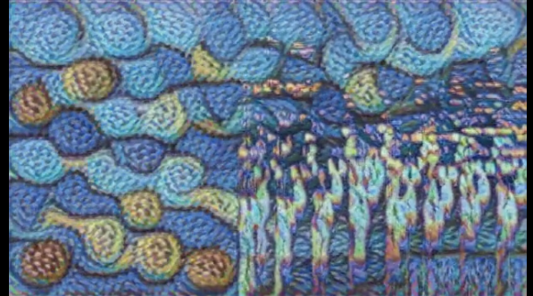
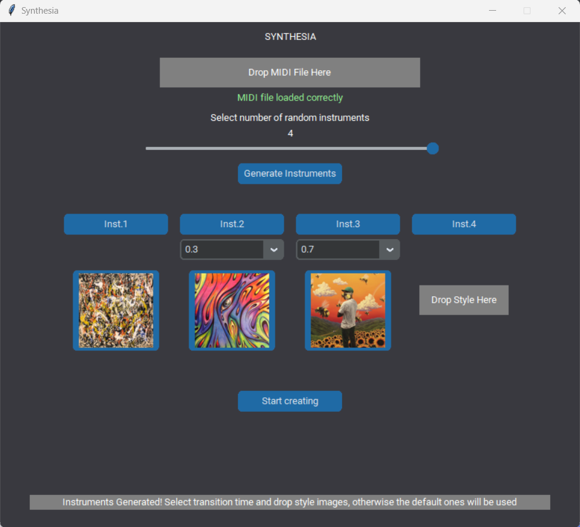
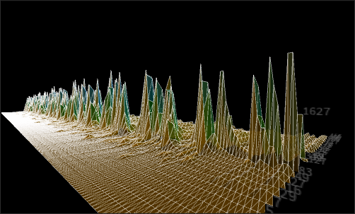

# Synthesia

We introduce Synthesia: An adaptable graphical instrument that enables you to perceive timbre transformation through visual elements.

Our perspective on Synthesia embraces its function as not only a dynamic tool for live performances but also as a standalone application committed to the creation of imaginative videos. Synthesia comprises two separate elements: Synthesia-Live and SynthesiApp.

### Preliminary steps
If you want to test our work, install all the required modules:
```
sh setupper.sh
```
This script will clone the 4 necessary repositories to make Synthesia work.

## SynthesiApp
### Features
SynthesiApp is a Python-based application that lets users load MIDI files and generate videos featuring audio spectrogram transformations, seamlessly transitioning between various styles. The audio generated undergoes a customizable timbre transfer process, giving users complete control over the video's style morphing timestamps.



### Workflow
Through its GUI, SynthesiApp allows users to input a MIDI file for GANSynth to process, specifying the number of instruments for timbre interpolation (ranging from 2 to 4) and providing timestamps utilized by both GANSynth for audio file creation and StyleTransfer for generating the final video. The GUI also enables users to select the images used for style transfer. Meanwhile, behind the scenes, Music-Visualizer is employed to generate the spectrogram video, which is subsequently subjected to the style transfer process.



### Environment setup
Create a the conda environment to work locally with:
```
conda create -n {name} python=3.7
conda activate {name}
```

To install the dependecies, do the following:
```
conda install -c conda-forge opencv
pip install magenta
pip install -r requirements.txt
```

If you are on linux, you will need to have the following dependencies installed:
```
sudo apt-get install build-essential libasound2-dev libjack-dev portaudio19-dev
```

If you are on MacOs, we suggest using the conda installation script found <a href="https://github.com/magenta/magenta/blob/main/README.md">here</a>. Although it seems not to be working (you still need to install magenta with pip)
 we found it helped the dependencies to work.

If you experience this problem (we did, on linux): 
```
/lib/x86_64-linux-gnu/libstdc++.so.6: version 'GLIBCXX_3.4.29' not found
```
It can be solved with <a href="https://github.com/pybind/pybind11/discussions/3453#discussioncomment-7068951">this</a>.

For other problems, please feel free to open an issue.

If you have the possibility to work with CUDA, you can do the following to exploit your GPU:
```
conda install -c conda-forge cudatoolkit=11.8
python3 -m pip install nvidia-cudnn-cu11==8.6.0.163
mkdir -p $CONDA_PREFIX/etc/conda/activate.d
echo 'CUDNN_PATH=$(dirname $(python -c "import nvidia.cudnn;print(nvidia.cudnn.__file__)"))' >> $CONDA_PREFIX/etc/conda/activate.d/env_vars.sh
echo 'export LD_LIBRARY_PATH=$CUDNN_PATH/lib:$CONDA_PREFIX/lib/:$LD_LIBRARY_PATH' >> $CONDA_PREFIX/etc/conda/activate.d/env_vars.sh
source $CONDA_PREFIX/etc/conda/activate.d/env_vars.sh
```
You can verify the GPU availability with:
```
python3 -c "import tensorflow as tf; print(tf.config.list_physical_devices('GPU'))"
```
This is an adaptation of the official tensorflow w/o GPU <a href="https://www.tensorflow.org/install/pip?hl=it">installation guide</a>, before it was updated (30/9/23...).

If you are working on linux or mac and in an environment with ffmpeg (for example if you have opencv in it), it most likely will be outdated and will cause an error over the drange parameter when creating the video spectrogram. To avoid this, install the most recent static version found <a href="https://johnvansickle.com/ffmpeg/">here</a> and follow this <a href="https://www.johnvansickle.com/ffmpeg/faq/">guide</a> for the installation (for linux, but similar concepts apply to MacOs). Then put you new ffmpeg path in SynthesiaGUI.py (lines 203-207) before lauching the script to specify the updated version of ffmpeg, avoiding the one in the environment.

## Synthesia-Live
### Features
Synthesia-Live operates in real-time, applying style transfer techniques to the incoming audio's spectrogram. This process combines two distinct styles in accordance with the user's timbre morphing preferences.

### Workflow
Synthesia-Live operates by opening Nsynth (Magenta's software) within Ableton and using Ableton's Connection Kit to send OSC messages from Ableton to Processing. The OSC message sent pertains to the interpolation value between the two timbres being morphed by Nsynth. In Processing, an audio spectrogram is generated from the output of Nsynth. Python establishes a socket connection with Processing as soon as possible and begins requesting frames from the spectrogram drawn by Processing, along with the OSC interpolation value. Based on the interpolation value received in Python, the appropriate model is chosen for style transfer on the requested spectrogram frame. Once the style transfer is applied, the frame is displayed to the user on the screen.

### Environment setup
Create a the conda environment to work locally with:
```
conda create -n {name}
conda activate {name}
```

Then procede installing the required dependencies:
```
pip install -r requirements_LIVE.txt
```
If you have a GPU (highly suggested) and you want to exploit it with chainer, you'll need to follow this <a href="https://docs.cupy.dev/en/latest/install.html">guide</a> for the installation of CuPy.

You can check this process was successful by:
```
python3 -c "from chainer import cuda; print(cuda.get_device(0))"
```

To replicate out total setup, you will need the models we trained thorugh this the <a href="https://github.com/peregoniccolo/real-time-style-transfer">real-time-style-transfer</a> module. This will be obtained through the setupper.

You will also need the Nsynth Ableton live set, available <a href="https://storage.googleapis.com/nsynth-m4l/NSynthProject.zip">here</a> and the connection pack. NB: Nsynth unfortunately only works on Ableton 10.

### Instructions
To use Synthesia-Live, start by opening Nsynth in Ableton and send the interpolation value via the Connection Kit (OSC send), creating a mapping with one of the NSynth axes. Once you've confirmed that Nsynth's output is readable as your computer's audio input, run the SynthesiaLIVE.py file followed by the sketch_3D_Spectrum_2.pde file. Now, you can enjoy altering the Nsynth interpolation value and experience real-time visual feedback.

If you are working on a single PC, the OSC send tool in Ableton will need to be set up as ip:127.0.0.1, port:32000. If you are instead working over a network, specify as ip the address of the machine Processing is running on. NB, in this case, the audio will not be sent along to the processing, you'll need to physically connect the 2 computers. 




## Modules 
- https://github.com/cpuguy96/real-time-style-transfer

- https://github.com/magenta/magenta/tree/main/magenta/models/gansynth

- https://github.com/nvfp/Music-Visualizer

- https://github.com/westgarthb/style-transfer-video-processor

Our forks:
- https://github.com/peregoniccolo/real-time-style-transfer

- https://github.com/peregoniccolo/magenta

- https://github.com/peregoniccolo/Music-Visualizer

- https://github.com/peregoniccolo/style-transfer-video-processor

## Remarks
This project was mainly developed and tested on the following configuration:
- OS: Linux debian 5.10.0-25-amd64 #1 SMP Debian 5.10.191-1 (2023-08-16) x86_64 GNU/Linux
- CPU: Intel i7-6500U CPU @ 2.50GHz
- GPU: NVIDIA GeForce 920MX

It was also tested on a Macbook Pro A2142 (i7), but the experience is optimized for linux.